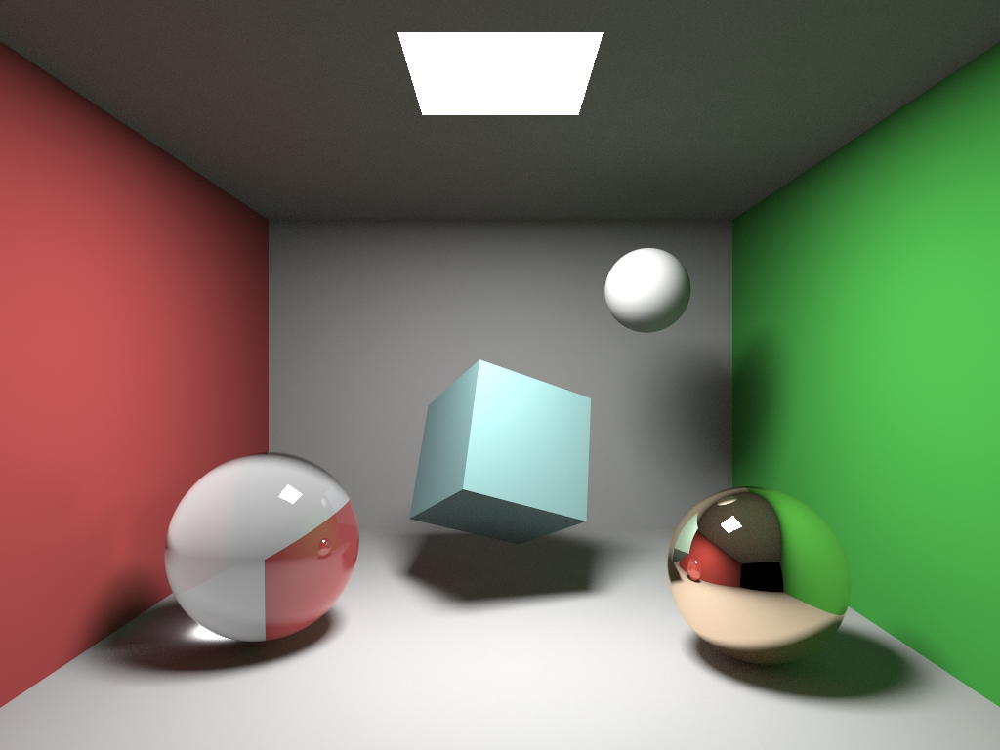
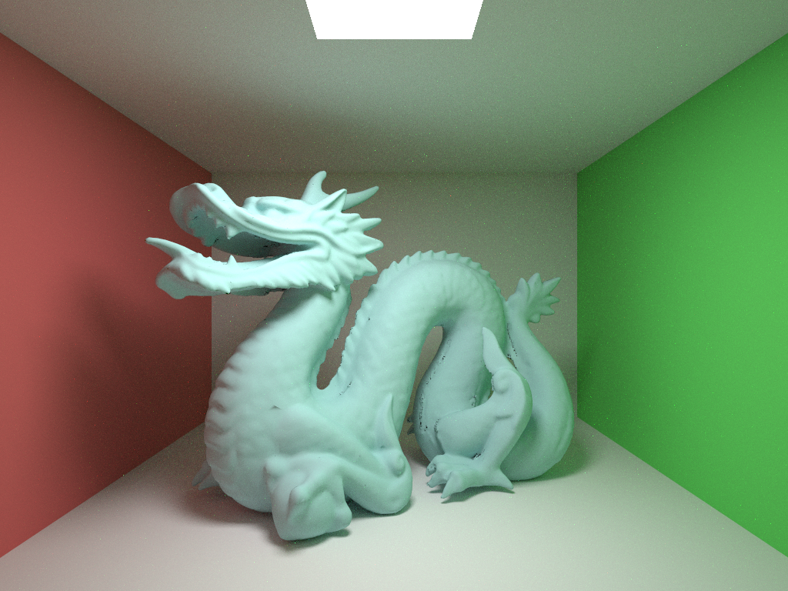
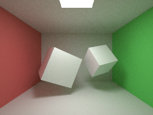
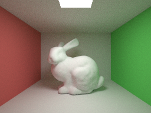
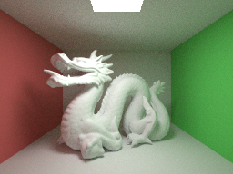

# Monte Carlo Ray Tracer

This project is a program for rendering virtual 3D scenes with the global illumination algorithm Monte Carlo ray tracing.

The algorithm recursively trace light rays from the camera out in the scene and bounces them around on / through the surface of objects.

The project was made for the course Advanded Global Illumination and Rendering, TNCG15, at Linköpings University.

## Features

* Some predefined object classes (spheres, planes).
* Possibility to load triangle meshes in to the scene.
	* Octree data structure used to partition triangles for faster rendering.
* Material properties for 3D objects
	* Diffuse color
	* Specular color
	* Reflectance [0, 1]
	* Specular reflectance [0 (diffuse), 1 (mirror)]
	* Transmissivity [0, 1]
	* Refraction_index [1 (air), 2.4 (diamond)]
	* Roughness [0, inf) Used for evaluation of the Oren-Nayar BRDF
* Monte Carlo ray tracing algorithm, simulates many light phenomena:
	* Color bleeding
	* Soft shadows
	* Reflection
		* Currently not considering the Fresnel effect.
	* Refraction
		* Uses Schlick's approximation to Fresnels equations for reflected part.
* Photon mapping for caustic effects.
	* Using a kd tree from the c++ library "kdtree++" by Martin F. Krafft.
* Simple paralellization using openMP.
* Using the XML parser pugixml to be able to load XML files describing the scenes.

## Future Work

* Implement a depth of field technique.
* Other optimizations (reduce cash misses, simplify code, precomputing, better paralellization technique).
* Make different wavelengths refract a different amount and increase number of wavelengths.
	* This way it is possible to achieve rainbow effects from refraction.
